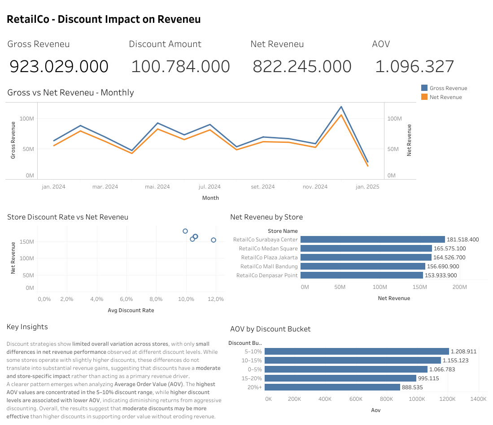

# Discount Dependency in RetailCo Net Revenue

## Overview
This project analyzes the relationship between discount strategies and net revenue in a retail environment. The objective is to understand how different discount levels relate to revenue outcomes and to support pricing and promotional decision making using data.

[Project Page (business oriented view)](https://www.kaiopacheco.com/retailcodiscountdependencyandnetrevenue)

## Business Problem
Retail companies frequently rely on discounts to drive demand, but excessive discounting can negatively impact overall revenue. This analysis evaluates whether higher discount levels are consistently associated with higher net revenue and how this relationship varies across customer segments and related business dimensions.

## Dataset
Public retail transactions dataset containing multiple CSV tables, including transactions, customers, stores, and user access logs.

**Datasource:**  
[RetailCo Sales Transactions Dataset (Kaggle)](https://www.kaggle.com/datasets/pramudyadika/retailco-sales-transactions-dataset)

## Analytical Workflow
- Loaded and validated dataset tables using SQL executed within a Python environment
- Built analytical tables and aggregations to quantify discount distribution and net revenue behavior
- Explored how net revenue responds across discount ranges and key business segments
- Summarized dependency patterns and translated findings into clear analytical conclusions

## Dashboard

The Tableau dashboard provides a visual overview of discount distribution and net revenue behavior across segments. It supports the analytical findings by making it easier to observe revenue patterns across discount levels and compare performance across key groupings.

## Key Insights
- Discounted transactions consistently represent a major share of net revenue
- Net revenue behavior slightly varies across customer segments and other business dimensions
- Contrary to initial expectations, wholesale customers do not consistently generate higher purchase volume

## Tools and Technologies
- **SQL**
- **Python** (DuckDB, Pandas, NumPy, Matplotlib)
- **Data Visualization:** Tableau
